

<h3 align="center">Prompt as Code | GPT-Image2 Industrial Prompt Engine & Template Library, 370+ Reverse-Engineered Cases, 18 Industrial Templates</h3>

  
  
  
  

  <strong>English</strong> | <a href="./README.zh-CN.md">简体中文</a>

> Updated irregularly with new workflows. Stars are welcome.
> This project is sponsored by [Ciyuan API](https://ciyuan.today/), an AI aggregation platform for cost-effective GPT Image 2 access.

## ⚡️ Project Vision

After GPT-Image2 became widely available, AI image generation moved from "can it make an image?" to "can it make stable, controllable, reusable images?" This project turns scattered community examples into Prompt-as-Code assets that are easier for agents and automation workflows to reuse.

The core goal is simple: compress prose-style prompts into structured protocols. When you need batch generation, template systems, or production workflows, this structure is more valuable than a pile of isolated examples.

- 🧱 Atomic schema: split subjects, lighting, materials, layout, and visual details into composable parts
- ⚙️ Workflow friendly: designed for agents, scripts, and automation systems
- 🧬 Structured control: improve controllability for layout, copy, and information hierarchy

## 📖 Quick Links

- [Full case gallery](docs/gallery.md)
- [Gallery Part 1: cases 1-165](docs/gallery-part-1.md)
- [Gallery Part 2: cases 166-378](docs/gallery-part-2.md)
- [Industrial prompt templates and pitfalls guide](docs/templates.md)
- [MIT License](LICENSE)
- [Full disclaimer](docs/disclaimer.md#section-disclaimer)

## 🗂️ Category Overview

Start with the case album to find a visual direction, then open the prompt template categories to turn that direction into reusable structure.

### 🖼️ Case Album

<table>
  <tr>
    <td width="33%" valign="top" align="center">
      
<strong>🧩 UI & Interfaces</strong> 68 cases

       
      Apps, websites, dashboards, social screenshots, and product interfaces. 
      <a href="docs/gallery.md#cat-ui"><strong>View Cases</strong></a>
    </td>
    <td width="33%" valign="top" align="center">
      
<strong>📊 Charts & Infographics</strong> 55 cases

      <a href="docs/gallery.md#cat-infographic">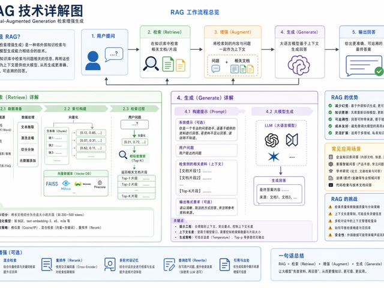</a> 
      Infographics, knowledge maps, technical explainers, and structured diagrams. 
      <a href="docs/gallery.md#cat-infographic"><strong>View Cases</strong></a>
    </td>
    <td width="33%" valign="top" align="center">
      
<strong>📰 Posters & Typography</strong> 71 cases

      <a href="docs/gallery.md#cat-poster">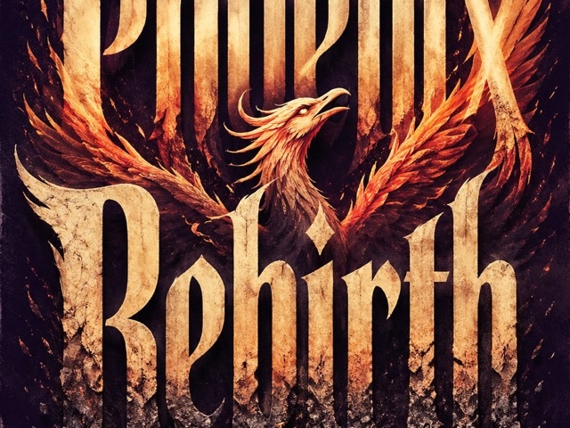</a> 
      Event posters, covers, type-driven visuals, and strong layout compositions. 
      <a href="docs/gallery.md#cat-poster"><strong>View Cases</strong></a>
    </td>
  </tr>
  <tr>
    <td width="33%" valign="top" align="center">
      
<strong>🛍️ Products & E-commerce</strong> 24 cases

      <a href="docs/gallery.md#cat-product">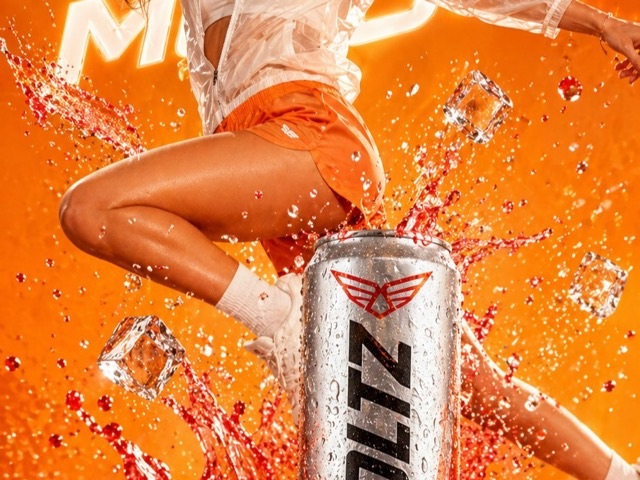</a> 
      Product shots, detail pages, packaging, selling points, and ads. 
      <a href="docs/gallery.md#cat-product"><strong>View Cases</strong></a>
    </td>
    <td width="33%" valign="top" align="center">
      
<strong>🏷️ Brand & Logos</strong> 19 cases

      <a href="docs/gallery.md#cat-brand">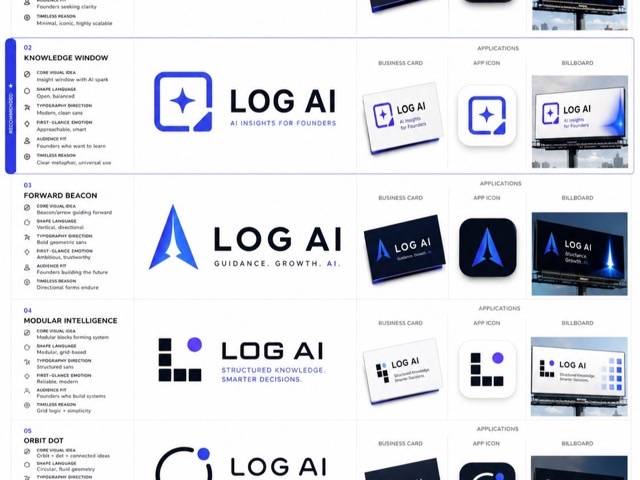</a> 
      Logos, identity systems, brand touchpoints, and campaign visuals. 
      <a href="docs/gallery.md#cat-brand"><strong>View Cases</strong></a>
    </td>
    <td width="33%" valign="top" align="center">
      
<strong>🏛️ Architecture & Spaces</strong> 25 cases

      <a href="docs/gallery.md#cat-architecture">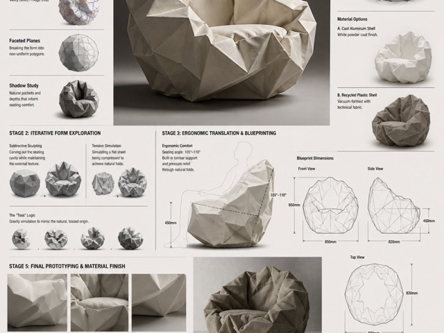</a> 
      Architecture renders, interiors, city maps, and spatial concepts. 
      <a href="docs/gallery.md#cat-architecture"><strong>View Cases</strong></a>
    </td>
  </tr>
  <tr>
    <td width="33%" valign="top" align="center">
      
<strong>📷 Photography & Realism</strong> 34 cases

      <a href="docs/gallery.md#cat-photo">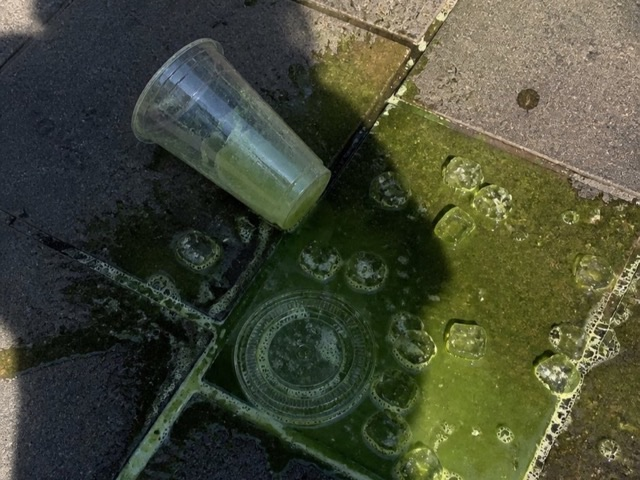</a> 
      Portraits, phone photography, film texture, and commercial photography. 
      <a href="docs/gallery.md#cat-photo"><strong>View Cases</strong></a>
    </td>
    <td width="33%" valign="top" align="center">
      
<strong>🎨 Illustration & Art</strong> 25 cases

      <a href="docs/gallery.md#cat-illustration">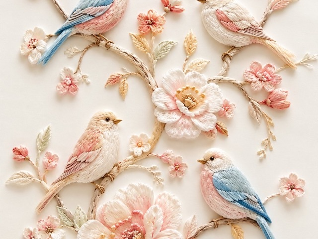</a> 
      Illustration, art styles, material experiments, and decorative images. 
      <a href="docs/gallery.md#cat-illustration"><strong>View Cases</strong></a>
    </td>
    <td width="33%" valign="top" align="center">
      
<strong>🧍 Characters & People</strong> 14 cases

       
      Character design, pose references, cards, and 3D toys. 
      <a href="docs/gallery.md#cat-character"><strong>View Cases</strong></a>
    </td>
  </tr>
  <tr>
    <td width="33%" valign="top" align="center">
      
<strong>🎬 Scenes & Storytelling</strong> 7 cases

      <a href="docs/gallery.md#cat-scene">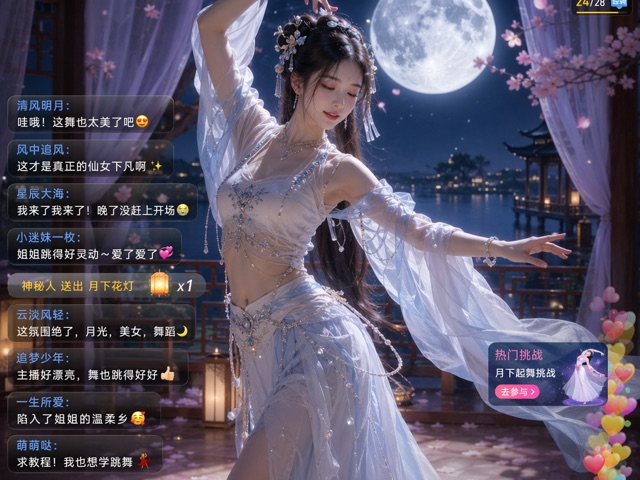</a> 
      Storyboards, narrative scenes, livestream frames, and worldbuilding. 
      <a href="docs/gallery.md#cat-scene"><strong>View Cases</strong></a>
    </td>
    <td width="33%" valign="top" align="center">
      
<strong>🏮 History & Classical Chinese Themes</strong> 9 cases

      <a href="docs/gallery.md#cat-history">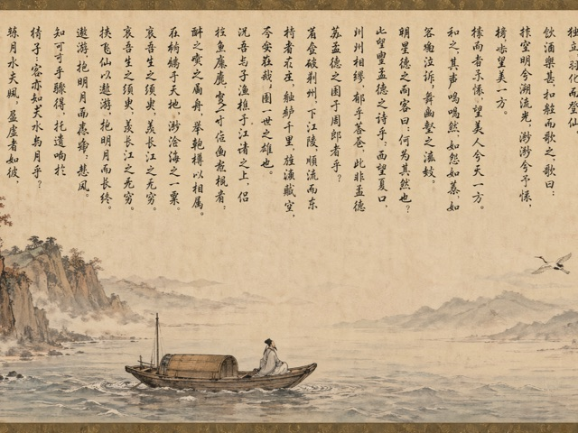</a> 
      Classical scrolls, historical figures, traditional themes, and poetry visuals. 
      <a href="docs/gallery.md#cat-history"><strong>View Cases</strong></a>
    </td>
    <td width="33%" valign="top" align="center">
      
<strong>📚 Documents & Publishing</strong> 7 cases

      <a href="docs/gallery.md#cat-document">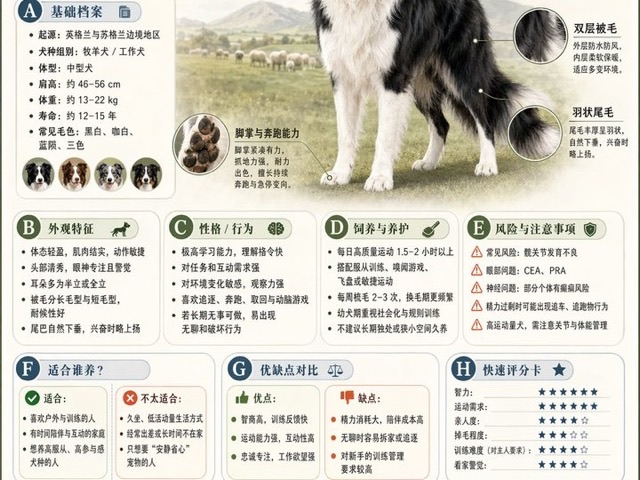</a> 
      White papers, manuals, encyclopedic plates, and publishing layouts. 
      <a href="docs/gallery.md#cat-document"><strong>View Cases</strong></a>
    </td>
  </tr>
  <tr>
    <td width="33%" valign="top" align="center">
      
<strong>🧪 Other Use Cases</strong> 20 cases

      <a href="docs/gallery.md#cat-other">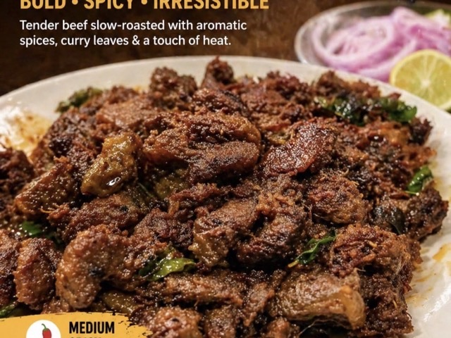</a> 
      Creative experiments, special tasks, mixed workflows, and practical cases. 
      <a href="docs/gallery.md#cat-other"><strong>View Cases</strong></a>
    </td>
    <td width="33%" valign="top" align="center">
      <h4>🖼️ Full Gallery</h4>
      <a href="docs/gallery.md">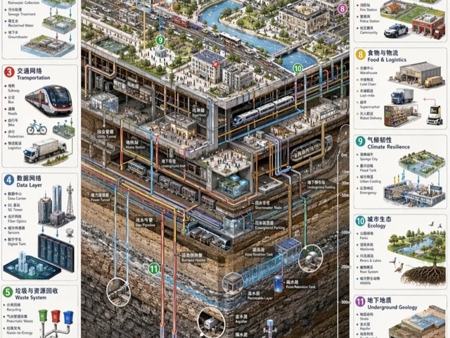</a> 
      Browse all 378 cases by gallery part and category. 
      <a href="docs/gallery.md"><strong>Open Gallery</strong></a>
    </td>
    <td width="33%" valign="top" align="center">
      <h4>⭐ Latest Additions</h4>
       
      The newest X community cases and workflows collected in the repo. 
      <a href="docs/gallery-part-2.md#case-378"><strong>View Latest</strong></a>
    </td>
  </tr>
</table>

### 🧩 Prompt Template Categories

The prompt body remains in the original template document for now. This homepage only adds an English navigation layer.

<strong>Template Page 1 / 4: Design & Information</strong>

| Category | Template Entry | Core Capability |
|---|---|---|
| 🧩 UI & Interfaces | [View Prompts](docs/templates.md#tpl-ui) | Components, page hierarchy, screenshot texture |
| 📊 Charts & Infographics | [View Prompts](docs/templates.md#tpl-infographic) | Modules, arrows, data structure, readability |
| 📰 Posters & Typography | [View Prompts](docs/templates.md#tpl-poster) | Layout, headline systems, people, visual impact |

<strong>Template Page 2 / 4: Commerce & Space</strong>

| Category | Template Entry | Core Capability |
|---|---|---|
| 🛍️ Products & E-commerce | [View Prompts](docs/templates.md#tpl-product) | Product selling points, packaging, detail-page structure |
| 🏷️ Brand & Logos | [View Prompts](docs/templates.md#tpl-brand) | Logos, identity, brand touchpoint systems |
| 🏛️ Architecture & Spaces | [View Prompts](docs/templates.md#tpl-architecture) | Perspective, materials, indoor and outdoor lighting |

<strong>Template Page 3 / 4: Imaging & Characters</strong>

| Category | Template Entry | Core Capability |
|---|---|---|
| 📷 Photography & Realism | [View Prompts](docs/templates.md#tpl-photo) | Lenses, lighting, realistic textures |
| 🎨 Illustration & Art | [View Prompts](docs/templates.md#tpl-illustration) | Brushwork, materials, art styles |
| 🧍 Characters & People | [View Prompts](docs/templates.md#tpl-character) | Character design, pose sheets, consistency |

<strong>Template Page 4 / 4: Narrative & Extensions</strong>

| Category | Template Entry | Core Capability |
|---|---|---|
| 🎬 Scenes & Storytelling | [View Prompts](docs/templates.md#tpl-scene) | Storyboards, worldbuilding, emotional pacing |
| 🏮 History & Classical Chinese Themes | [View Prompts](docs/templates.md#tpl-history) | Dynasties, clothing, scroll-style narrative |
| 📚 Documents & Publishing | [View Prompts](docs/templates.md#tpl-document) | Page systems, tables of contents, layout rules |
| 🧪 Other Use Cases | [View Prompts](docs/templates.md#tpl-other) | Mixed tasks, experimental workflows, special outputs |

## 🖼️ Featured Cases

### Case 1: Infographic Visualization

An engineering-whitepaper-style infographic case for studying modular structure, information hierarchy, and bilingual labels.
[View full case](docs/gallery-part-1.md#case-1)

### Case 2: Social Media Interface Screenshot

A mixed "product interface + social content screenshot" case for controlling text blocks, UI frames, and content cards.
[View full case](docs/gallery-part-1.md#case-2)

### Case 6: Illustration Art

A Japanese fantasy illustration example for studying atmosphere, color, and large-scene composition.
[View full case](docs/gallery-part-1.md#case-6)

### Case 17: Interaction Design Diagram

A classic "structured breakdown + explanatory layout" case for product diagrams and poster-like technical explainers.
[View full case](docs/gallery-part-1.md#case-17)

### Case 166: Twelve Gold Saints Card Set

A multi-card, unified-style case for studying batch generation and series design.
[View full case](docs/gallery-part-2.md#case-166)

### Case 310: Snack Brand Technical Breakdown

A strong hybrid of brand narrative, structural breakdown, and commercial presentation. Useful as an "infographic + brand visual" reference.
[View full case](docs/gallery-part-2.md#case-310)

### Canghe Original Tests

<table>
  <tr>
    <td width="33%" valign="top" align="center">
      
<strong>Case 330: Moonlit Livestream Scene</strong>

       
      A high-fidelity livestream screenshot reference for UI atmosphere, comments, and realistic people. 
      <a href="docs/gallery-part-2.md#case-330"><strong>View Case</strong></a>
    </td>
    <td width="33%" valign="top" align="center">
      
<strong>Case 334: RAG Technical Explainer</strong>

       
      A reference for technical concepts, process arrows, and Chinese explanation modules. 
      <a href="docs/gallery-part-2.md#case-334"><strong>View Case</strong></a>
    </td>
    <td width="33%" valign="top" align="center">
      
<strong>Case 338: Red Cliff Classical Scroll</strong>

       
      A complete example of scroll format, classical Chinese narrative, and full-text layout. 
      <a href="docs/gallery-part-2.md#case-338"><strong>View Case</strong></a>
    </td>
  </tr>
  <tr>
    <td width="33%" valign="top" align="center">
      
<strong>Case 331: Hand-Drawn Xi'an Watercolor Map</strong>

       
      A lightweight reference for city maps, hand-drawn routes, and landmark labels. 
      <a href="docs/gallery-part-2.md#case-331"><strong>View Case</strong></a>
    </td>
    <td width="33%" valign="top" align="center">
      
<strong>Case 332: Tea Pi Product Poster</strong>

       
      A beverage product image combining Chinese selling points and a clean commercial poster style. 
      <a href="docs/gallery-part-2.md#case-332"><strong>View Case</strong></a>
    </td>
    <td width="33%" valign="top" align="center">
      
<strong>Case 339: Apple-Style Nature Science Poster</strong>

       
      Minimal studio photography, a natural subject, and science-poster information layout. 
      <a href="docs/gallery-part-2.md#case-339"><strong>View Case</strong></a>
    </td>
  </tr>
</table>

### Latest X Community Additions

Only the latest 24-hour collection run is shown here. Older X imports stay in the full gallery.

<table>
  <tr>
    <td width="25%" valign="top" align="center">
      
<strong>Case 375: Ancient Greek Philosophers Timeline City Map</strong>

       
      Historical figures, city background, and timeline storytelling. 
      <a href="docs/gallery-part-2.md#case-375"><strong>View Case</strong></a>
    </td>
    <td width="25%" valign="top" align="center">
      
<strong>Case 376: Spilled Matcha Street Phone Photo</strong>

       
      Phone documentary style, realistic lighting, and negative constraints. 
      <a href="docs/gallery-part-2.md#case-376"><strong>View Case</strong></a>
    </td>
    <td width="25%" valign="top" align="center">
      
<strong>Case 377: Sakura Coffee Outdoor Portrait</strong>

       
      Reference-image editing, identity preservation, and outdoor lifestyle photography. 
      <a href="docs/gallery-part-2.md#case-377"><strong>View Case</strong></a>
    </td>
    <td width="25%" valign="top" align="center">
      
<strong>Case 378: Premium 3D Collectible Toy Avatar</strong>

       
      Reference photo to 3D collectible toy while preserving identity anchors. 
      <a href="docs/gallery-part-2.md#case-378"><strong>View Case</strong></a>
    </td>
  </tr>
</table>

## 🧩 Template Entry

The full template library lives in [`docs/templates.md`](docs/templates.md). Use the **Prompt Template Categories** above for quick category jumps, or open [Industrial prompt templates and pitfalls guide](docs/templates.md) for the complete template text.

## 🚀 How To Use This Repository

1. Start from the featured cases and decide what output type you want to imitate.
2. Open the full gallery and find nearby cases. Copy structure first, then style words.
3. Return to the template page and fill your business variables into the general or JSON templates.

## 📄 Notes & Disclaimer

## Acknowledgements & Sources

During collection and research, this project references public prompt-library content from [YouMind](https://youmind.com/) and [OpenNana](https://opennana.com/) for learning, summarization, and methodology research. Copyright belongs to the original authors or platforms. If any content is infringing or inappropriate, please contact us and we will correct or remove it promptly.

## Disclaimer

This project only organizes publicly accessible community prompts and example images for learning and research. It does not claim ownership of any third-party original content.

All prompt cases and generated images in this repository were initially inspired by public community sources, especially [YouMind](https://youmind.com/) and [OpenNana](https://opennana.com/). The project aims to break down strong examples into reusable structured protocols for learning, summarization, and automated testing with large-model agents.

- We make every effort to preserve original sources, including author profiles, original post links, and source repository links.
- For third-party content, we follow source repository statements, licenses such as `CC BY 4.0`, and the relevant platform rules.
- If you are the original author or rights holder and believe an entry should not be displayed, please open an Issue with the entry link. We will review it and remove it quickly when appropriate.
- This repository does not guarantee that third-party content can be used commercially. Please obtain authorization from the original rights holder before commercial use.

**If this library helps you, please star the repository.**

## Star History

## WeChat Official Account

Search **苍何** on WeChat or scan the QR code below to follow Canghe's original WeChat official account. Reply with **AI** to get more AI prompt learning resources.

## 📜 License

This project is open source under the [MIT License](LICENSE). You can use, modify, distribute, and build on it freely while preserving the license notice.
